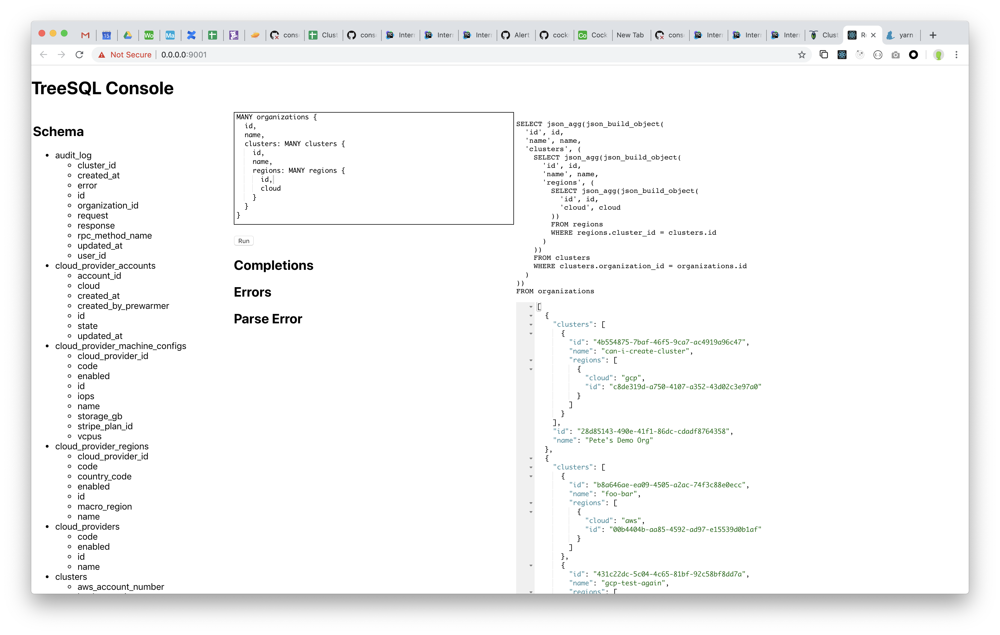

# TreeSQL to SQL

TreeSQL UI Console.
- Schema on the left
- TreeSQL editor and completions in the middle
- generated SQL on the top right
- JSON results on the bottom right

## What is in this repo?

A server which provides:

- An HTTP endpoint which executes TreeSQL queries by translating them to SQL queries. It returns
  results as JSON.
- A simple console UI (pictured) which allows authoring TreeSQL queries (with schema-aware
  autocomplete), executing them, and seeing results.

## What is TreeSQL?

A new query language which is halfway between SQL and GraphQL.

It's like SQL, except you write joins by starting with one table, and nesting the tables
you want to join to within curly braces, forming a tree of joins. Results come back as a tree
of JSON mirroring the query try.

It's like GraphQL, except that it has a direct mapping onto a DB schema (i.e. there's no arbitrary
code between the query and the data storage, as there is in GraphQL servers) and it has a more
SQL-like syntax (WHERE clauses, etc).
  
## How is TreeSQL translated to SQL?

By translating it to a correlated subquery, which uses Postgres/Cockroach's builtin JSON
functions to combine all results into a single JSON datum -- a one-row, one-column result set. 

## What's missing?

A lot of things.
- `GROUP BY` (unclear what the syntax should be for this)
- `ORDER BY`
- Joining from one to one (only supports one to many)
- etc
